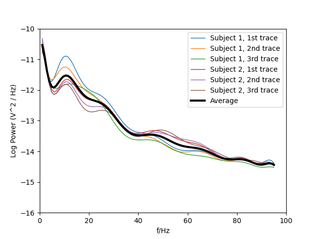

# Pure EEG power during paralysis

[](https://zenodo.org/badge/latestdoi/529194569)

Power spectra of pure EEG from two temporarily paralysed
subjects.

Data from (Fig 1, B-traces):

[Scalp electrical recording during paralysis: Quantitative evidence that
EEG frequencies above 20 Hz are contaminated by EMG
Emma M. Whitham, Kenneth J. Pope, Sean P. Fitzgibbon, Trent Lewis,
C. Richard Clark, Stephen Loveless, Marita Broberg, Angus Wallace,
Dylan DeLosAngeles, Peter Lillie, Andrew Hardy, Rik.
Clinical Neurophysiology Volume 118, Issue 8, August 2007,
Pages 1877-1888.](https://www.sciencedirect.com/science/article/abs/pii/S1388245707001988)

I've contacted Elsevier's Copyrights Coordinator and he confirmed that there is no need to obtain formal permission
from Elsevier. You merely need to acknowledge the original source. Please cite as "Data from Whitham 2007 ..." (see
https://www.elsevier.com/about/policies/copyright/permissions).



## Installation

Locally by just running `python setup.py install` or via pypi:

```
pip install nmb_eeg
```

## Usage

To obtain the average PSD over all experiments just use
the default constructor:
```
p = NMB_EEG_From_WhithamEtAl()
```

If you want to extract the PSD of dataset one do:
```
p = NMB_EEG_From_WhithamEtAl(1)
```

Obtain the power spectral density in V^2/Hz use:
```
psd = p.EEGVariance(f)
```
where `f` can be either a single frequency or a numpy array.
The lowest permitted frequency is
`f_signal_min` and the highest `f_signal_max`.

The total power of the entire frequency range from `f_signal_min` to `f_signal_max` is:
```
totalEEGPower = p.totalEEGPower()
```

Because `EEGVariance(f)` accepts a numpy array plotting the spectrum
is simply:
```
f = np.linspace(p.f_signal_min,p.f_signal_max,100)
plt.plot(f,p.EEGVariance(f))
```

### Usage example

Run:
```
plot_paralysed_EEG_PSD.py
```
which generates the plot at the top of this page.


## Class reference

```
    class NMB_EEG_From_WhithamEtAl(builtins.object)
     |  NMB_EEG_From_WhithamEtAl(datasetIndex=-1, degree=15)
     |  
     |  __init__(self, datasetIndex=-1, degree=15)
     |      Constructor which prepares the power spectrum from Figure `datasetIndex` from Whitham et al 2007
     |      using a polynomial fit. The default degreee is 15. If no datasetIndex is
     |      given or is negative then the average from all 6 figures from the paper is calculated.
     |  
     |  EEGVariance(self, frequency)
     |      Returns the EEG variance (i.e. power spectral density) in V^2/Hz at the specified frequency or 
     |      frequency ranges if frequency is a numpy array. The lowest permitted frequency is
     |      `f_signal_min` and the highest `f_signal_max`.
     |  
     |  totalEEGPower(self)
     |      Calculates the total power of the EEG in V^2 between `f_signal_min` and `f_signal_max`.
     |  
     |  allsubjectdesciption = ['Subject 1, 1st trace', 'Subject 1, 2nd trace'...
     |  
     |  f_signal_max = 95
     |  
     |  f_signal_min = 1
```


## Credit

Bernd Porr <bernd.porr@glasgow.ac.uk>
